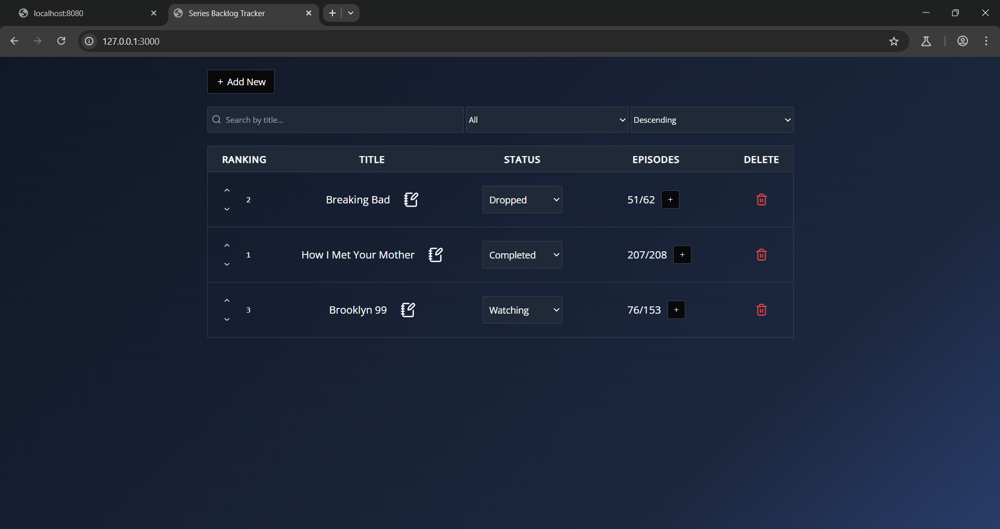

# Lab 6 Web
# Backend para Series Tracker

## Descripción
Este proyecto consiste en el desarrollo de un backend para la aplicación web "Series Tracker". La aplicación permite a los usuarios gestionar su lista de series de TV o Anime. Se proporciona un frontend preexistente, y el objetivo es desarrollar un backend REST API que interactúe con dicho frontend.

## Estructura del Proyecto

```
- backend/
  - main.go               # Código principal del backend en Go
  - Dockerfile            # Configuración para crear la imagen Docker del backend
- basedatos/
  - init.sql              # Script SQL para la creación de la base de datos y la tabla de series
  - docker-compose.yml    # Configuración de Docker para desplegar MySQL y el backend en contenedores
```

## Requisitos Previos
- Docker y Docker Compose instalados.

## Configuración y Ejecución

### 1. Clonar el repositorio
El frontend puede ejecutarse de cualquier manera que el usuario prefiera, ya sea con un servidor local o de otra forma. El backend está diseñado para comunicarse con él sin necesidad de configuraciones adicionales. Esto es solo muestra de donde es que se encuentra el frontend.
```sh
git clone <URL_DEL_REPOSITORIO>
cd series-tracker
```

### 2. Levantar la base de datos y el backend
Ejecuta el siguiente comando desde la carpeta `basedatos/`:
```sh
cd basedatos
docker-compose up --build
```
Esto iniciará tanto la base de datos MySQL como el backend en Go dentro de contenedores Docker.

## Uso del Backend
El backend expone los siguientes endpoints:

### Endpoints obligatorios:
- `GET /api/series` - Obtener todas las series.
- `GET /api/series/{id}` - Obtener una serie por su ID.
- `POST /api/series` - Crear una nueva serie.
- `PUT /api/series/{id}` - Actualizar una serie existente.
- `DELETE /api/series/{id}` - Eliminar una serie.

### Endpoints adicionales:
- `PATCH /api/series/{id}/status` - Actualizar el estado de una serie.
- `PATCH /api/series/{id}/episode` - Incrementar el episodio actual.
- `PATCH /api/series/{id}/upvote` - Aumentar la puntuación de una serie.
- `PATCH /api/series/{id}/downvote` - Disminuir la puntuación de una serie.

## CORS
El backend permite solicitudes desde cualquier origen (`*`), con los métodos `GET, POST, PUT, DELETE, PATCH, OPTIONS`.


## Pruebas con Postman
Se proporciona una colección de Postman para facilitar la prueba de la API. Puedes acceder a ella en el siguiente enlace:
[Enlace a la colección de Postman](#)

## Captura de Pantalla del funcionamiento


## Archivo llms.txt
Se ha incluido un archivo `llms.txt` con una explicación del uso del API.
